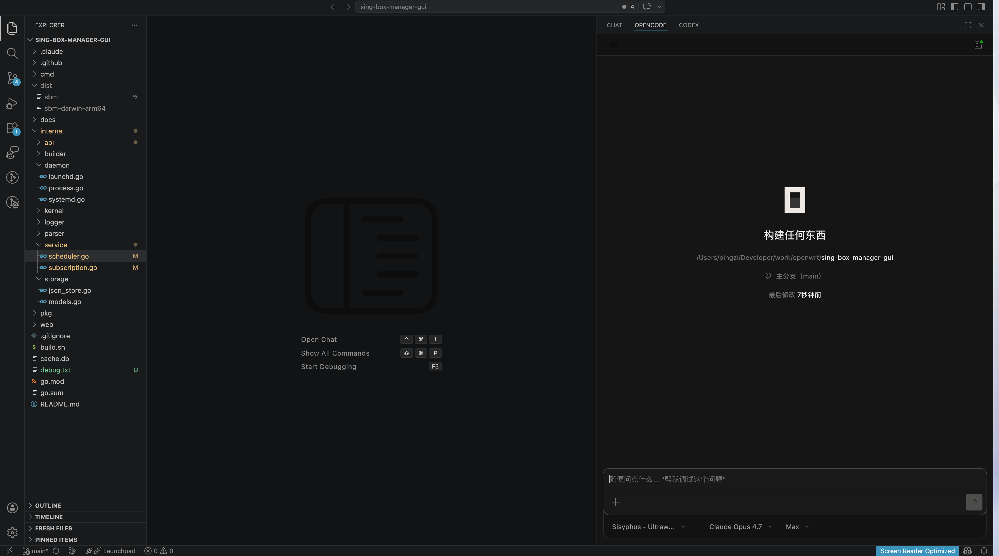

# OpenCode IDE — VS Code fork with native OpenCode agent sidebar

> A desktop IDE built on a Microsoft VS Code fork, with the [OpenCode](https://opencode.ai) AI coding agent embedded as a first-class, native sidebar chat experience — not a web extension, not a webview bolt-on, but a vendored SPA served through an in-process proxy in the Electron main.

[](LICENSE.txt)
[](https://github.com/microsoft/vscode)
[](https://www.electronjs.org/)
[](https://opencode.ai)



---

## Why another VS Code fork?

Most "AI IDE" forks (Cursor, Windsurf, Trae, Void, …) glue an AI chat panel in via a webview or embedded extension. That works, but it leaks: weird CSP rules, broken file drops, session loss on reload, no real control over auth, process lifecycle, or ports.

**OpenCode IDE** takes the opposite approach:

- The entire OpenCode chat UI (`packages/app` from the main opencode repo) is **vendored** into the fork as a static SPA.
- An **Electron-main-side loopback HTTP proxy** (`ISpaProxyService`) serves that SPA and transparently proxies every API call to a locally managed `opencode serve` backend.
- The workbench sidebar shows a tiny iframe pointing at `http://127.0.0.1:<stable_port>/<base64_workspace>` — so the agent UI gets its own real origin, full CSP isolation, and stable session state across reloads.
- An **`IOpencodeServeManager`** handles `opencode serve` child-process lifecycle (spawn, health probe, port recovery, HTTP Basic auth injection for opencode ≥ 1.14.19, clean shutdown).

The result is a fork where the AI agent behaves like a native VS Code panel: drag-and-drop files from the explorer into the chat, keep your session on window reloads, run the backend on any port you configure, and ship everything as a single desktop app.

---

## Features

- **Native OpenCode sidebar** — the opencode SPA loaded as a real iframe from a loopback origin, with full file-drop integration from the VS Code explorer.
- **Managed `opencode serve` backend** — auto-start / auto-respawn / port pinning / HTTP Basic auth, all from the Electron main process.
- **Proposed `opencodeEditor` VS Code API** — a scaffolded proposed API surface (`src/vs/workbench/api/`) so extensions can interact with the agent host.
- **Smoke-tested drop flow** — Playwright-based sidebar file-drop smoke tests (`test/smoke`) covering real runtime behavior, not just unit stubs.
- **Fork-friendly build** — a dedicated `Makefile` wraps the VS Code gulp build, SPA vendoring, smoke suite, and dev launch commands.
- **Clean separation from upstream** — fork-only code lives under `src/vs/workbench/contrib/opencode/` and a few well-scoped integration points; everything else stays close to upstream VS Code so rebasing on Microsoft's `main` stays cheap.

---

## Architecture at a glance

OpenCode's chat UI runs as a vendored SPA loaded into the workbench via a loopback HTTP proxy.

### Process model

- **Main process** (`src/vs/code/electron-main/app.ts`)
  - `ISpaProxyService` — HTTP server that serves the vendored SPA and proxies API calls to the backend.
  - `IOpencodeServeManager` — manages the `opencode serve` child-process lifecycle.
  - `ISpaProxyService` is exposed to the renderer via the IPC channel `opencodeSpaProxy`.

- **Renderer process** (electron-browser)
  - `registerMainProcessRemoteService(ISpaProxyService, 'opencodeSpaProxy')` creates the IPC proxy.
  - `sidebarPane.ts` computes the iframe URL: `http://127.0.0.1:<stable_port>/<base64_workspace>`.

### Rebuilding the vendored SPA

```bash
# 1. Build the SPA in the main opencode repo
cd ../packages/app
bun run build

# 2. Copy the built dist/ into the fork's vendored directory
cp -r dist/ <fork>/src/vs/workbench/contrib/opencode/media/spa/

# 3. Recompile the fork
cd <fork>
make compile        # or: npm run compile
```

Or, from inside this repo, a single `make vendor-spa` does all three when the main opencode repo is a sibling directory.

### User-facing settings

| Setting | Type | Default | Purpose |
|---|---|---|---|
| `opencode.autoStart` | boolean | `true` | Auto-start `opencode serve` on window open |
| `opencode.port` | number | `5888` | Backend port |
| `opencode.binaryPath` | string | `""` | Override the opencode binary path |

---

## Build and run

Prerequisites are the same as upstream VS Code: Node.js 22.x (see `.nvmrc`), Python, native build tools. The main opencode repo should be cloned as a sibling directory if you want to rebuild the SPA.

```bash
# install deps
make install-deps

# one-shot full build
make compile

# watch-mode dev loop
make watch

# launch the dev build
make run

# smoke tests (full suite)
make smoke
# smoke tests filtered to OpenCode integration
make smoke-opencode
```

See `Makefile` for every available target.

### opencode backend binary

The `opencode serve` binary is bundled automatically by `make build`. The build pipeline:

1. **Pins** the binary via `build/opencode-backend.json` — a manifest that records the source commit and sha256 for each platform.
2. **Validates and copies** the binary into `.vendored/opencode/bin/opencode` (run `make vendor-opencode-backend` to rebuild + revalidate, or `make vendor-opencode-backend-validate-only` to re-validate sha256 and copy without rebuilding).
3. **Packages** the validated binary into the `.app` at `Contents/Resources/opencode/bin/opencode` as part of the gulp packaging step.

In a packaged build the IDE always uses the bundled binary. If the bundled binary is missing at startup, the IDE refuses to start and shows a "Please reinstall OpenCode IDE" error.

For local development you can override the binary with the `opencode.binaryPath` setting — this is ignored in packaged builds.

---

## Relationship to upstream VS Code

This repository is a fork of [microsoft/vscode](https://github.com/microsoft/vscode) at a pinned commit. Upstream is tracked as the `upstream` remote; fork work lives on the `main-fork` branch. The fork keeps:

- a distinct product identity (`product.json` → `nameShort: OpenCode`, `applicationName: opencode-ide`, `urlProtocol: opencode`),
- a dedicated contribution area at `src/vs/workbench/contrib/opencode/` for all fork-only feature code,
- a proposed `opencodeEditor` API surface,
- build-script additions to ship the vendored SPA inside the desktop bundle.

Everything else is stock VS Code OSS, MIT-licensed.

---

## Keywords

*These are here so automated code search, AI coding agents, and engineers looking for specific implementations can actually find this project.*

`opencode` · `opencode ide` · `opencode vscode` · `opencode vscode fork` · `opencode-vscode-ide` · `opencode desktop` · `opencode electron` · `opencode sidebar` · `opencode native integration` · `opencode serve manager` · `opencode SPA proxy` · `opencode AI agent` · `opencode coding agent` · `opencode.ai` · `vscode fork ai agent` · `vscode ai coding agent` · `vscode fork with embedded agent` · `electron loopback proxy iframe` · `vscode contrib opencode` · `opencodeEditor proposed api` · `ai coding ide` · `open source ai ide` · `claude code alternative` · `cursor alternative` · `windsurf alternative` · `void alternative` · `trae alternative` · `opencode IDE native sidebar` · `vscode fork opencode integration` · `vscode electron main proxy` · `spa proxy service vscode` · `opencode ISpaProxyService` · `opencode IOpencodeServeManager` · `opencode ide build from source`

### SEO description (copy for GitHub "About")

> OpenCode IDE — a Microsoft VS Code fork with the OpenCode AI coding agent embedded natively as a sidebar SPA via an Electron-main loopback proxy. Open source alternative to Cursor / Windsurf / Claude Code Desktop.

---

## Contributing

Fork work lives on `main-fork`. Please keep commits scoped and prefixed (`feat(opencode):`, `fix(opencode):`, `test(opencode):`, `docs(opencode):`, `build:`). When touching the VS Code core, try to keep the diff minimal and rebase-friendly; new integration code should land under `src/vs/workbench/contrib/opencode/` or behind clearly scoped hooks.

For upstream VS Code contribution guidelines, see [the upstream CONTRIBUTING guide](https://github.com/microsoft/vscode/blob/main/CONTRIBUTING.md).

---

## License

Fork code: MIT (`LICENSE.txt`), inherited from [microsoft/vscode](https://github.com/microsoft/vscode).

OpenCode is a separate project by [opencode.ai](https://opencode.ai); its SPA bundle is vendored here under its own license. See [opencode.ai/docs](https://opencode.ai/docs) and the [OpenCode GitHub org](https://github.com/anomalyco/opencode) for the canonical source.

This project is **not** built, endorsed, or sponsored by Microsoft, by the OpenCode team, or by Anthropic.
